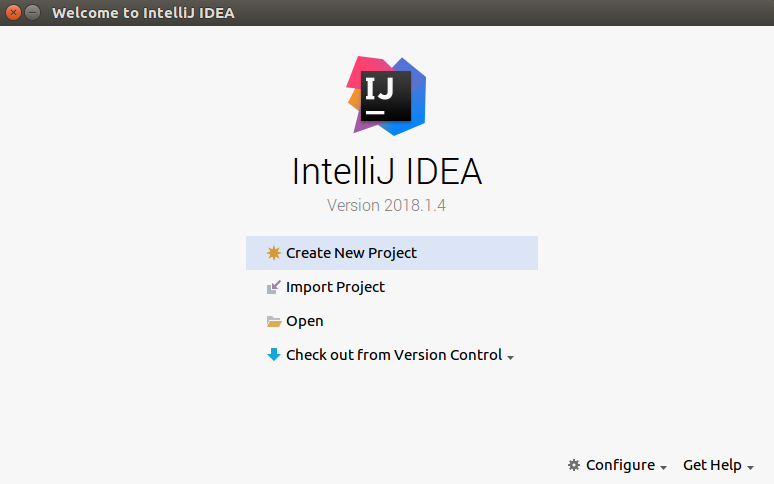
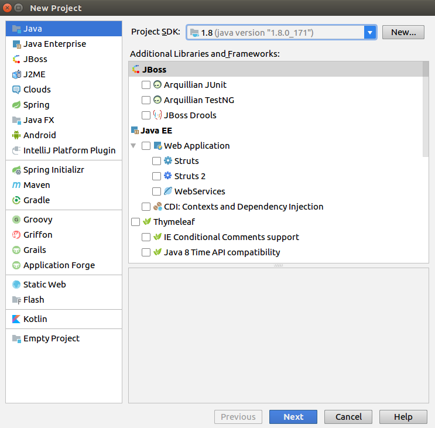
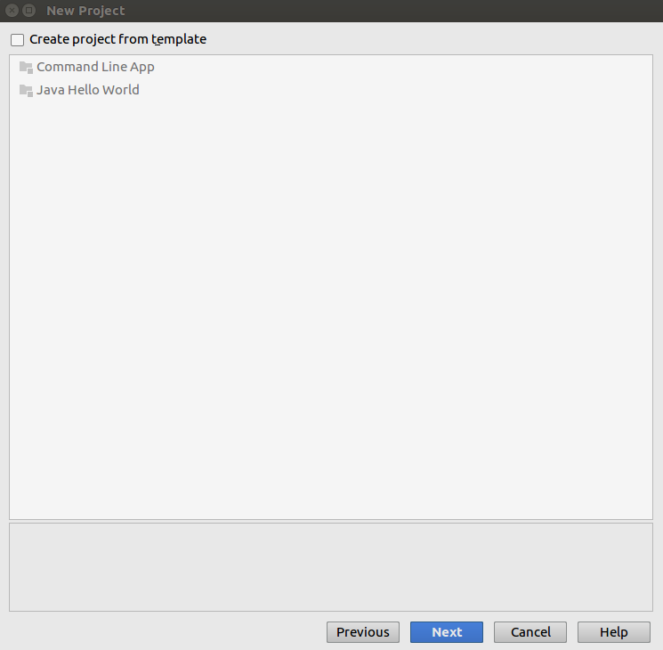
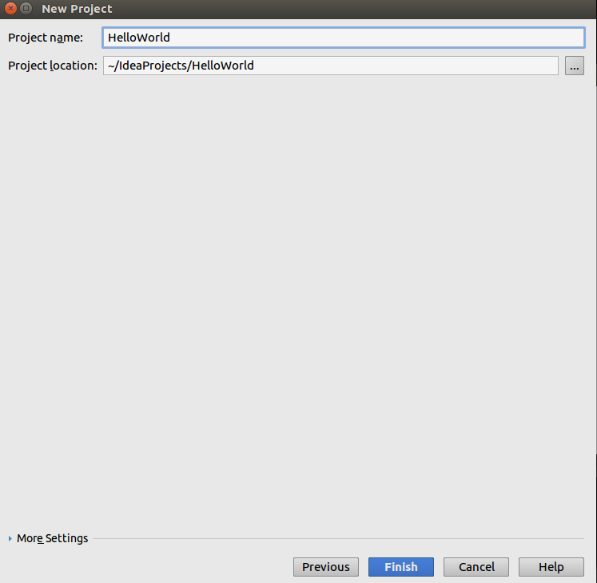
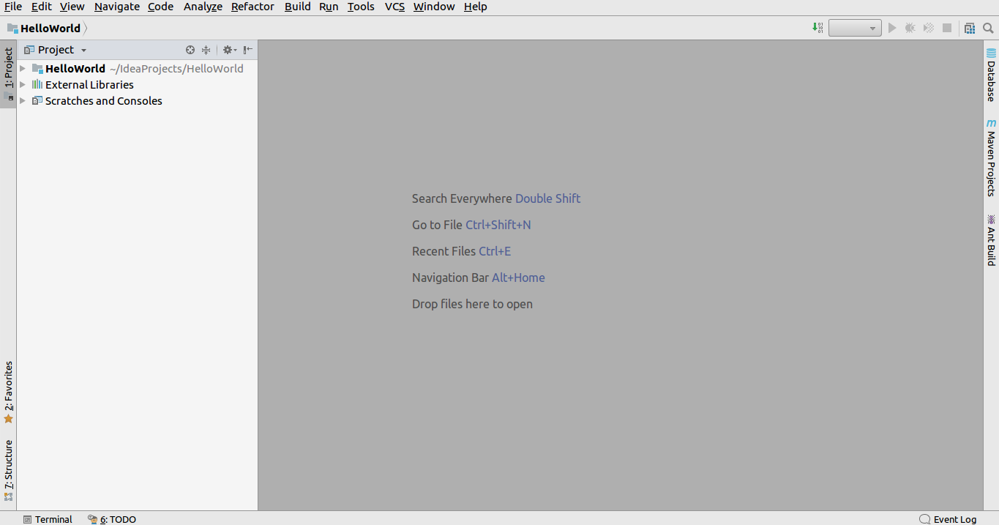
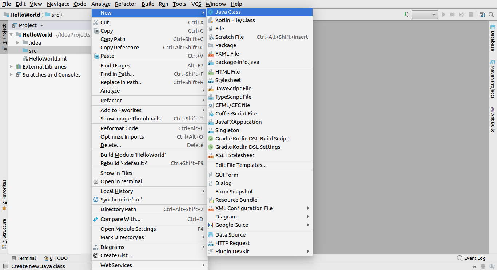
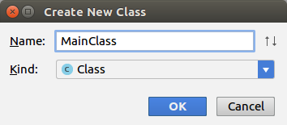
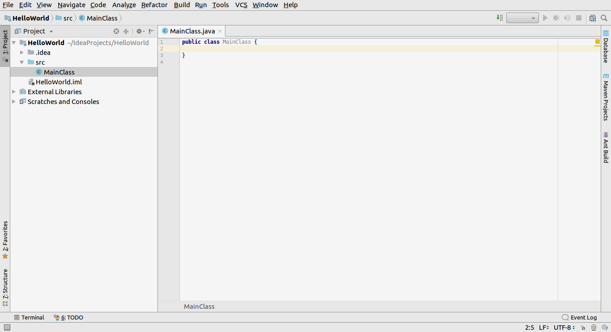
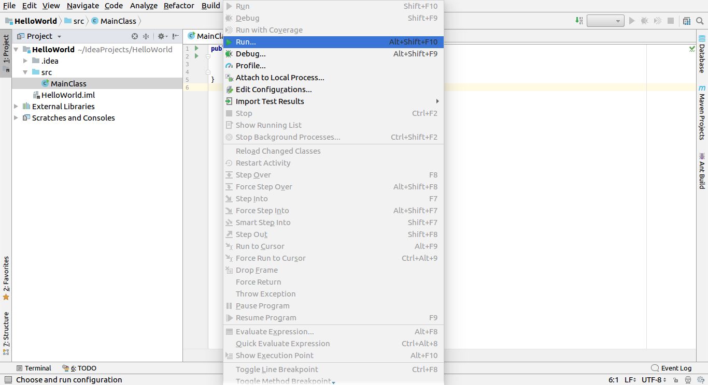
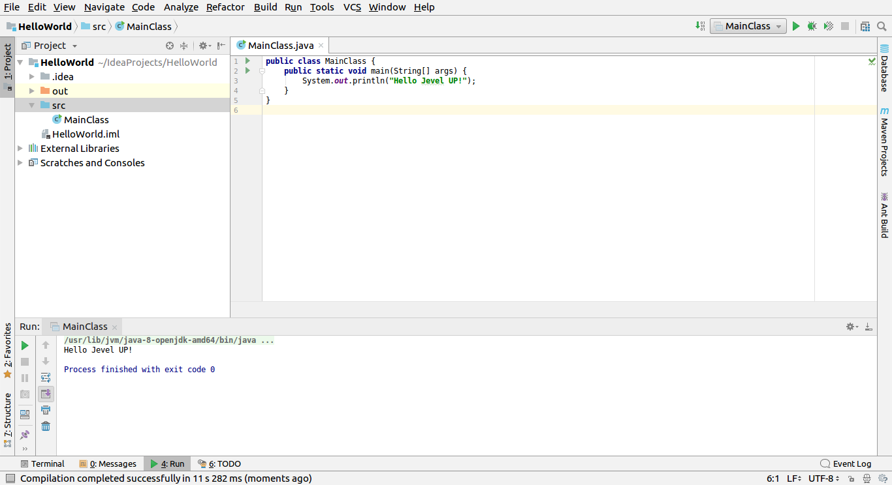

# Создание проекта

## 1. Запуск IntelliJ IDEA

## 2. Создание проекта

В окне появившемся после запуска IntelliJ IDEA надо выбрать пункт **_Create New Project_**.

## 3. Выбор типа проекта

На этом этапе можно выбрать тип проекта и добавить поддрержку фраемворков в проект.

Так как нам необходим обычный Java проект на этом этапе необходимо просто нажать **_Next_**.

## 4. Выбор шаблона проекта

Нам не нужен ни один из представленный шаблонов, поэтому нажимает **_Next_**.

## 5. Расположение проекта и имя проекта

В поле **Project name** можно указать имя проекта, для примера **_HelloWorld_**.

В поле **Project location**  можно указать место расположение проекта.

## 6. Проект создан

После завершения всех настроек мо можем приступить к написанию кода.

## 7. Добавление первого класса.

Для добавления нового класса:

В левой части экрана находится дерево проекта. Необходимо развернуть пункт с именем вашего проекта(в промере это HelloWord)

Далее необходимо кликнуть провой клавишей мыши(можно и тачпад использовать, но на свой страх и риск) по папке **_src_**.

В появившемся окне нужно выбрать пункты **_New -> Java Class_**.

## 8. Имя класса

В поле **Name** необходимо ввести имя класса. Для нашего примера это _**MainClass**_.

## 9. Класс создан

Теперь вы можете видеть созданный класс в области редактора. Так же новый класс появился в дереве проекта.

## 10. Пишем код

Теперь необходимо добавить точку входа в программу - метод _**main**_. И добавить строку кода которая выведет текста на экран.

Ваш код должен выглядеть так:

    class HelloWorld {
        public static void main(String[] args) {
            System.out.println("Hello Jevel UP!");
        }
    }

## 11. Запускаем код

Для запуска программы необходимо выбрать пункт **Run** в панеле управления(вверху). В появившемся меню нужно выбрать пункт **Run...**.

Либо можно нажать сочетание клавиш **_Alt + Shift + F10_**.

## 12. Результат запуска

Результат выполения программы можно увидить внизу экрана в поле **Run**

