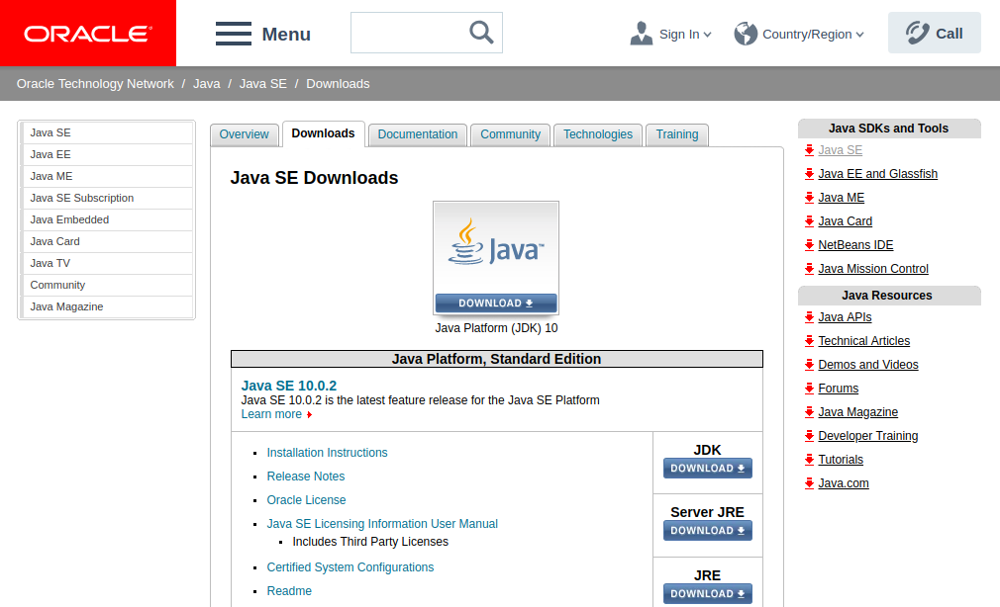
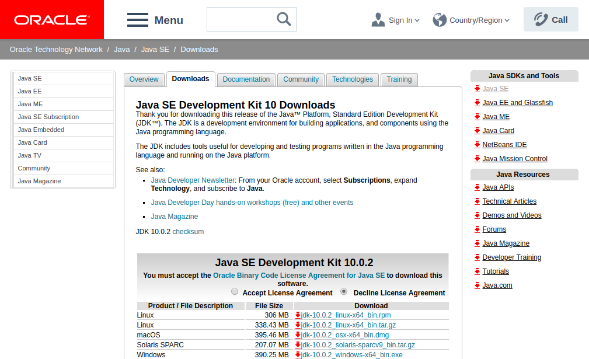
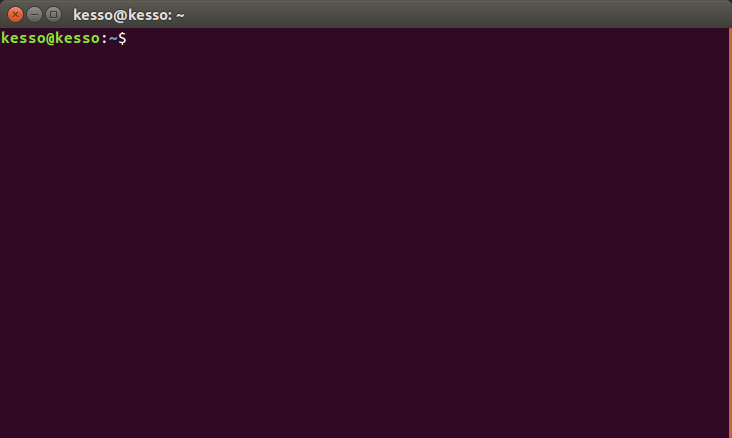
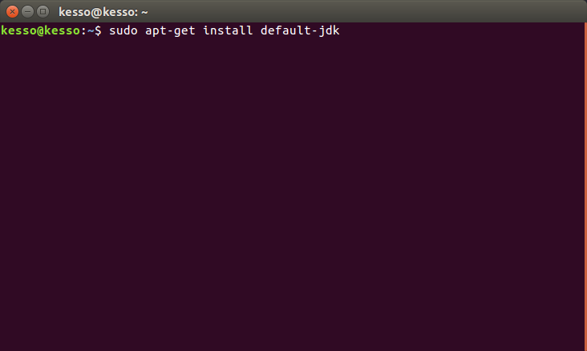

# Установка JDK
1. [Windows](#win)
2. [Ubuntu](#lin)

<a name="win"/>

# Windows

## Шаг 1: Скачать установочный файл с сайта

На сегодня местонахождения файлов для скачивания JDK находится по адресу [Java SE Downloads](https://www.oracle.com/technetwork/java/javase/downloads/index.html). Ваша задача — найти версию JDK, которая установится на ваш компьютер — выберите операционную систему и разрядность.

Перед скачивание необходимо согласится с условиями лицензии. Для этого надо просто поставить галочку в поле _**Accept License Agreement**_. После можно начать скачивание.

## Шаг 2: Установить JDK из файла

<a name="lin"/>

# Ubuntu

## Шаг 1: Откыть терминал

## Шаг 2: Установить JDK

Просто введите команду _**sudo apt-get install default-jdk**_

##
