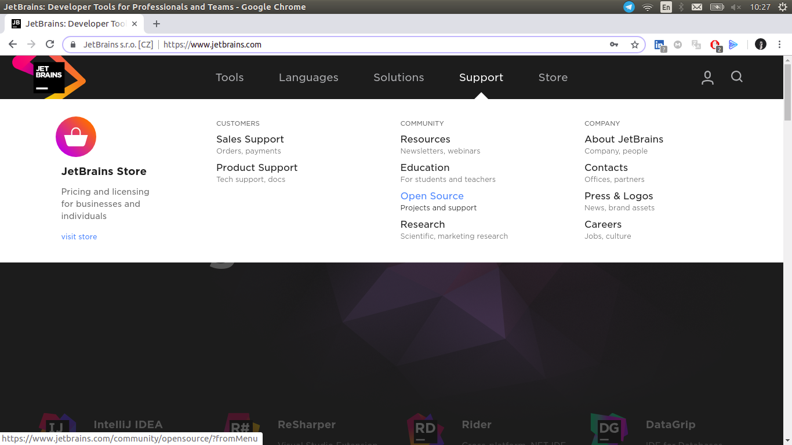
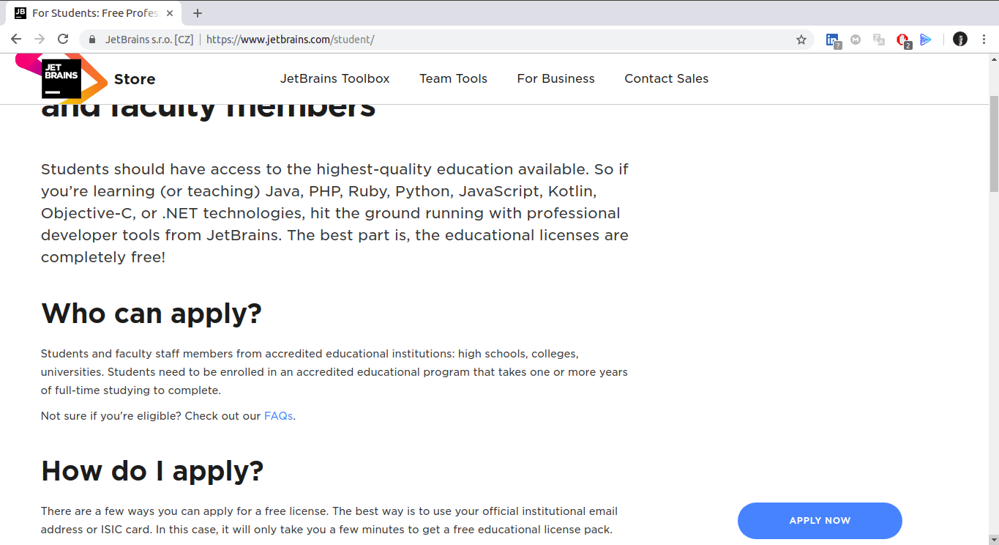
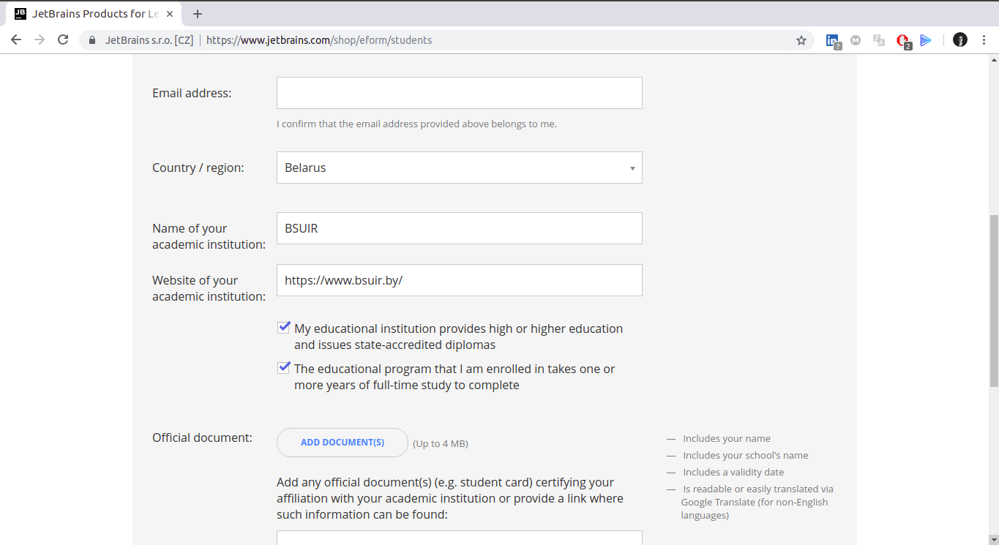

# Получение аккаунта JetBrains

## 1. https://www.jetbrains.com

## 2. Support -> Education

## 3. Apply now

## 4. Official document

## 5. Заплняем личную информацию

Имя и фамилию на английском(лучше из паспорта)
Действующий email(к которому привяжется лицензия)

## 6. Заполняем информацию о университете

## 7. Прикрепляем фото студенческого билета

Необходимо фото с двух сторон.

## 8. Отправляем запрос. Ждём до недели.
