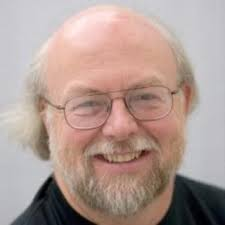

# Занятие 1. Введение.

1. Java
2. JVM

## Java

#### История содания
Создатели языка инженеры компании Sun Microsystems:

Патрик Ноутон (Patrick Naughton) - руководитель группы инженеров.

Джеймс Гослинг (James Gosling) - член Совета директоров и, как его еще иногда называют, разносторонний "компьютерный волшебник".

Изначально язык назывался Oak («Дуб»), разрабатывался для программирования бытовых электронных устройств. Впоследствии он был переименован в Java и стал использоваться для написания клиентских приложений и серверного программного обеспечения. Назван в честь марки кофе Java, которая, в свою очередь, получила наименование одноимённого острова (Ява), поэтому на официальной эмблеме языка изображена чашка с горячим кофе. Существует и другая версия происхождения названия языка, связанная с аллюзией на кофе-машину как пример бытового устройства, для программирования которого изначально язык создавался.
